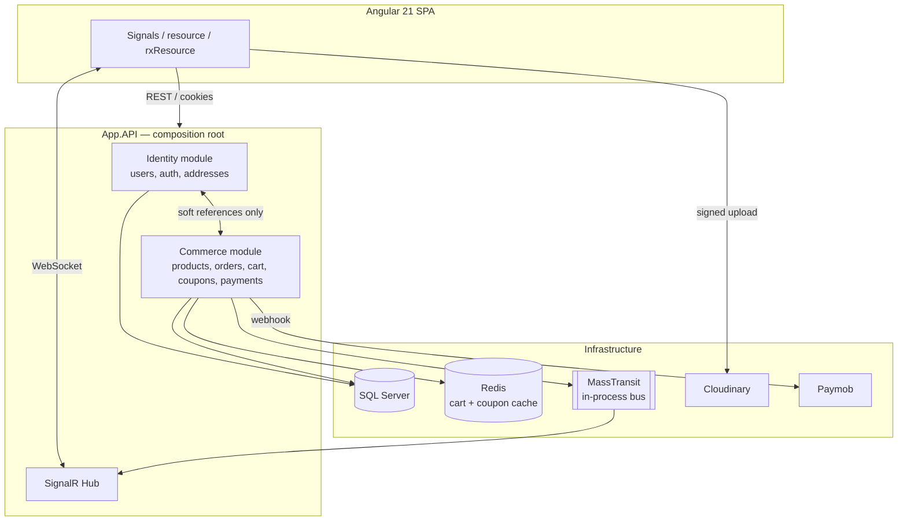

<div align="center">

[](https://git.io/typing-svg)

</div>

# MWGoods

A full-stack, multi-vendor e-commerce marketplace built as a **.NET modular monolith** with an **Angular 21** frontend — buyers and sellers on one platform, with an admin-moderated product approval pipeline, real-time notifications, and a payment flow built on Paymob.

---

## ✨ Features

### Marketplace & Roles

* Three roles — **Buyer**, **Seller**, **Admin** — with role-based authorization and dedicated dashboards for each
* Seller storefronts with a public "About" tab (approved products only) and an authenticated "Manage Products" tab
* Editable buyer/seller profiles: name, address, phone number, profile photo, and a seller-only brand name with a cooldown period between changes

### Product Moderation

* Sellers submit products in a `Pending` state; nothing goes live until an admin reviews it
* Admins approve or reject with a required rejection reason
* Editing an approved or rejected product automatically resubmits it for review
* Soft deletion — removed products are hidden from search immediately without breaking historical order data

### Real-Time Notifications

* **SignalR** hub, shared across payments and product moderation, with server-derived group membership (no client-trusted group names)
* Admins see the moderation queue update live as products are submitted
* Sellers get instant push notifications when their product is approved or rejected
* **MassTransit** pub/sub decouples "a product was submitted/approved/rejected" from "who needs to know" — new consumers can react to these events without touching the endpoints that raise them

### Payments & Checkout

* **Paymob** hosted checkout integration with HMAC-signature-verified webhooks
* Idempotent order creation — a webhook retry or duplicate delivery can never create two orders for the same payment
* Guest checkout: carts are Redis-backed and fully anonymous until the customer is ready to pay, at which point they're prompted to log in with their cart, coupon, and discount preserved

### Coupons & Discounts

* Percentage or fixed-amount coupons with minimum order thresholds, expiry windows, and optional per-customer single-use enforcement
* Atomic, race-condition-safe redemption counting via a single conditional SQL `UPDATE`, so concurrent checkouts can never oversell a limited-run code
* Coupon rules are cached (Redis) for fast repeated lookups; live redemption counts are always read fresh from the database
* Discount amounts are snapshotted per order — a coupon being edited or removed later never rewrites historical order data

### Media

* Product and profile photos upload **directly from the browser to Cloudinary** using short-lived signed tokens — the API server never touches raw image bytes, keeping upload handling fast and memory-light regardless of file size

### Wishlist

* Buyers can save products from any listing; saved items persist across sessions and devices, tied to their account rather than the browser

---

## 🏗️ Architecture

The backend is a **modular monolith**: multiple bounded contexts (Identity, Commerce) deployed as a single application, but built and reasoned about as if they could be split into separate services later.



**Key architectural decisions:**

* **No cross-module foreign keys.** Identity and Commerce reference each other only through soft references (plain string IDs) and shared `BuildingBlocks` contracts — never a direct FK or compile-time dependency between modules.
* **Specification pattern** for all non-trivial queries, keeping filtering/sorting/paging logic out of controllers and repositories consistent across entities.
* **EF Core owned types** (e.g. a `Photo` value object) and **global query filters** (soft delete) push data-shape invariants down into the persistence layer instead of trusting every call site to remember them.
* **Event-driven decoupling** via MassTransit — currently running on the in-memory transport, with the exact same publish/consume code portable to RabbitMQ without touching business logic, should this project ever need real distributed messaging.
* **Snapshotting over live references** wherever historical accuracy matters more than always-fresh data — order shipping addresses, ordered product details, and coupon redemption amounts are all captured at the moment they happen, immune to later edits of their source.

---

## 🛠️ Tech Stack

| Layer                     | Technologies                                                          |
| ------------------------- | --------------------------------------------------------------------- |
| **Backend**               | .NET, ASP.NET Core Web API, EF Core, SQL Server                       |
| **Messaging / Real-time** | MassTransit (in-memory transport), SignalR                            |
| **Caching**               | Redis (cart sessions, coupon rules)                                   |
| **Payments**              | Paymob                                                                |
| **Media**                 | Cloudinary (direct client-side signed uploads)                        |
| **Frontend**              | Angular 21, Angular Material, Tailwind CSS                            |
| **Auth**                  | Cookie-based (BFF pattern), ASP.NET Core Identity, antiforgery tokens |

---

## 🚀 Getting Started

### Prerequisites

* [.NET SDK](https://dotnet.microsoft.com/download) (latest LTS or newer)
* [Node.js](https://nodejs.org/) + npm
* SQL Server (local instance or container)
* Redis (local instance or container)
* A [Cloudinary](https://cloudinary.com/) account (cloud name, API key, API secret)
* A [Paymob](https://paymob.com/) account (API keys, integration ID, HMAC secret) — sandbox credentials are sufficient for local development

### Backend Setup

```bash
cd <path-to-api-project>

# Configure secrets — either via appsettings.Development.json or user-secrets
dotnet user-secrets set "ConnectionStrings:DefaultConnection" "<your-sql-connection-string>"
dotnet user-secrets set "ConnectionStrings:Redis" "<your-redis-connection-string>"
dotnet user-secrets set "CloudinarySettings:CloudName" "<cloud-name>"
dotnet user-secrets set "CloudinarySettings:ApiKey" "<api-key>"
dotnet user-secrets set "CloudinarySettings:ApiSecret" "<api-secret>"
dotnet user-secrets set "PaymentSettings:Paymob:SecretKey" "<secret-key>"
dotnet user-secrets set "PaymentSettings:Paymob:PublicKey" "<public-key>"
dotnet user-secrets set "PaymentSettings:Paymob:IntegrationId" "<integration-id>"
dotnet user-secrets set "PaymentSettings:Paymob:Hmac" "<hmac-secret>"

# Apply migrations and seed data
dotnet ef database update -p Commerce.Infrastructure -s App.API

# Run
dotnet run --project App.API
```

> **Paymob webhooks** need a publicly reachable URL during local development — a tunneling tool (e.g. ngrok) pointed at your local API is the simplest way to receive them while testing.

### Frontend Setup

```bash
cd client
npm install
ng serve
```

Update `environment.ts` / `environment.development.ts` with the API's base URL if it differs from the default.

---

## 📁 Project Structure

```text
mwgoods/
├── client/                       # Angular 21 SPA
│   └── src/app/
│       ├── core/                 # Services, guards, interceptors
│       ├── features/             # Route-level feature components
│       └── shared/               # Reusable components, models
├── App.API/                      # Composition root — DI wiring, controllers, hubs
├── Identity.Core/                 # Identity domain
├── Identity.Infrastructure/      # Identity persistence, EF config
├── Commerce.Core/                 # Commerce domain (Product, Order, Coupon, ...)
├── Commerce.Infrastructure/       # Commerce persistence, Cloudinary, MassTransit consumers
└── BuildingBlocks/                # Shared contracts between modules
```

> Adjust paths above to match your actual solution layout if it differs.

---

## 📸 Screenshots

*Add screenshots or a short demo GIF here.*

---

## 📄 License

*Add a license if you intend to open-source this repository.*
