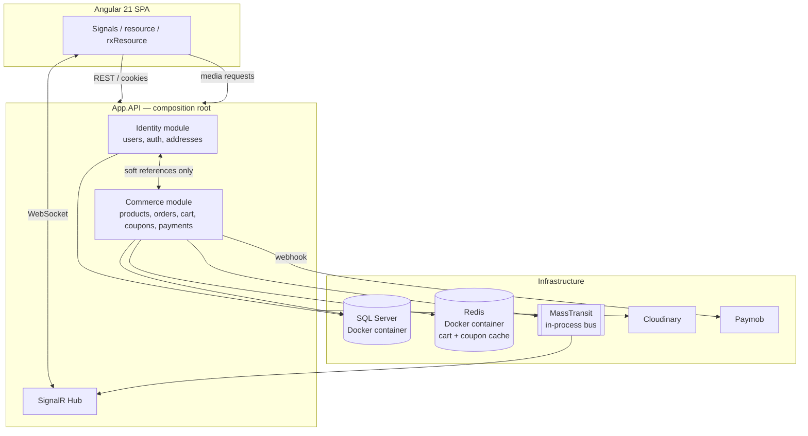
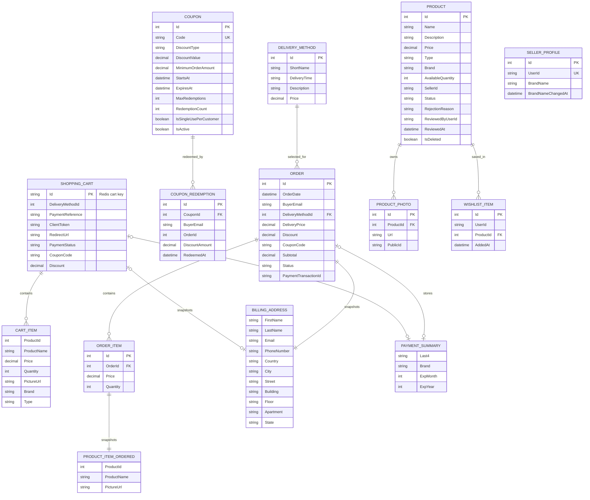

<div align="center">

[](https://git.io/typing-svg)

</div>

### 📱 App Demo Clip

<div align="center">
<video
src="https://github.com/user-attachments/assets/94bfaab6-b152-468c-800b-03ea8585d3da"
autoplay
muted
playsinline
preload="auto"
width="100%">
</video>
<br><br>
</div>

# MWGoods

A full-stack, multi-vendor e-commerce marketplace built with the **.NET 10 SDK** as a modular monolith and an **Angular 21** frontend — buyers and sellers on one platform, with an admin-moderated product approval pipeline, real-time notifications, and a payment flow built on Paymob.

---

## ✨ Features

### Marketplace & Roles

* Three roles — **Buyer**, **Seller**, **Admin** — with role-based authorization and dedicated dashboards for each
* Seller storefronts with a public "About" tab (approved products only) and an authenticated "Manage Products" tab
* Editable buyer/seller profiles: name, address, phone number, profile photo, and a seller-only brand name with a cooldown period between changes

### Product Moderation

* Sellers submit products in a `Pending` state; nothing goes live until an admin reviews it
* Admins approve or reject with a required rejection reason
* Editing an approved or rejected product automatically resubmits it for review
* Soft deletion — removed products are hidden from search immediately without breaking historical order data

### Real-Time Notifications

* **SignalR** hub, shared across payments and product moderation, with server-derived group membership (no client-trusted group names)
* Admins see the moderation queue update live as products are submitted
* Sellers get instant push notifications when their product is approved or rejected
* **MassTransit** pub/sub decouples "a product was submitted/approved/rejected" from "who needs to know" — new consumers can react to these events without touching the endpoints that raise them

### Payments & Checkout

* **Paymob** hosted checkout integration with HMAC-signature-verified webhooks
* Idempotent order creation — a webhook retry or duplicate delivery can never create two orders for the same payment
* Guest checkout: carts are Redis-backed and fully anonymous until the customer is ready to pay, at which point they're prompted to log in with their cart, coupon, and discount preserved

### Coupons & Discounts

* Percentage or fixed-amount coupons with minimum order thresholds, expiry windows, and optional per-customer single-use enforcement
* Atomic, race-condition-safe redemption counting via a single conditional SQL `UPDATE`, so concurrent checkouts can never oversell a limited-run code
* Coupon rules are cached (Redis) for fast repeated lookups; live redemption counts are always read fresh from the database
* Discount amounts are snapshotted per order — a coupon being edited or removed later never rewrites historical order data

### Media

* Product and profile photos are uploaded to and deleted from **Cloudinary through the API server**, keeping media management centralized and allowing the backend to control the full photo lifecycle

### Wishlist

* Buyers can save products from any listing; saved items persist across sessions and devices, tied to their account rather than the browser

### Experience & UI Design

* A deliberately designed home page showcases the product visually, with **GSAP** motion design and an interactive **Three.js vase** as part of the hero experience
* UI flows, layouts, and visual direction were designed in **Figma** before being brought into the Angular application

---

## 🏗️ Architecture

The backend is a **modular monolith**: multiple bounded contexts (Identity, Commerce) deployed as a single application, but built and reasoned about as if they could be split into separate services later.



**Key architectural decisions:**

* **No cross-module foreign keys.** Identity and Commerce reference each other only through soft references (plain string IDs) and shared `BuildingBlocks` contracts — never a direct FK or compile-time dependency between modules.
* **Specification pattern** for all non-trivial queries, keeping filtering/sorting/paging logic out of controllers and repositories consistent across entities.
* **EF Core owned types** (e.g. a `Photo` value object) and **global query filters** (soft delete) push data-shape invariants down into the persistence layer instead of trusting every call site to remember them.
* **Event-driven decoupling** via MassTransit — currently running on the in-memory transport, with the exact same publish/consume code portable to RabbitMQ without touching business logic, should this project ever need real distributed messaging.
* **Snapshotting over live references** wherever historical accuracy matters more than always-fresh data — order shipping addresses, ordered product details, and coupon redemption amounts are all captured at the moment they happen, immune to later edits of their source.
* **Dockerized local infrastructure** with SQL Server and Redis running in containers, making the development environment consistent and easy to set up across machines.

---

## 🛠️ Tech Stack

| Layer                     | Technologies                                                          |
| ------------------------- | --------------------------------------------------------------------- |
| **Backend**               | .NET 10 SDK, ASP.NET Core Web API, EF Core, SQL Server                |
| **Messaging / Real-time** | MassTransit (in-memory transport), SignalR                            |
| **Caching**               | Redis (cart sessions, coupon rules)                                   |
| **Payments**              | Paymob                                                                |
| **Media**                 | Cloudinary (server-managed uploads and deletions)                     |
| **Frontend**              | Angular 21, Angular Material, Tailwind CSS, GSAP, Three.js            |
| **Design**                | Figma                                                                 |
| **Auth**                  | Cookie-based (BFF pattern), ASP.NET Core Identity, antiforgery tokens |
| **Containerization**       | Docker (SQL Server and Redis containers)                              |

---

## 📁 Project Structure

```text
mwgoods/
├── client/                       # Angular 21 SPA
│   └── src/app/
│       ├── core/                 # Services, guards, interceptors
│       ├── features/             # Route-level feature components
│       ├── layout/               # Application layouts and shell components
│       └── shared/               # Reusable components, models
│
└── src/
    ├── BuildingBlocks/
    │   ├── BuildingBlocks.Application/
    │   ├── BuildingBlocks.Core/
    │   └── BuildingBlocks.Infrastructure/
    │
    ├── Modules/
    │   ├── Commerce/
    │   │   ├── Commerce.Application/
    │   │   ├── Commerce.Core/
    │   │   └── Commerce.Infrastructure/
    │   │
    │   └── Identity/
    │       ├── Identity.Application/
    │       ├── Identity.Core/
    │       └── Identity.Infrastructure/
    │
    ├── tests/
    │
    └── App.API/
        ├── Exceptions/
        ├── Filters/
        └── Modules/
            ├── Commerce/
            ├── Common/
            └── Identity/
```

---

## ER Diagram

### Commerce Module



---

## 📸 Screenshots

### 🔐 Authentication

#### Login


#### Register


### 🛍️ Shopping & Checkout Journey

#### From discovering products to completing an order — filtering, sorting, coupons, checkout steps, payment, and order creation, all in one flow.

[Checkout Lifecycle.webm](https://github.com/user-attachments/assets/fb2e8d94-0397-4644-803a-1777bec0c779)

### 👤 Profile & Product Management

#### From personalizing your profile to managing the entire product lifecycle. Sellers can update their information and profile photo, manage approved products, edit or remove listings, and submit new products for review. Admins can then review pending products and approve or reject submissions, with approved products automatically appearing in the seller's live product list.

[Profile & Product Management.webm](https://github.com/user-attachments/assets/23982ffb-10de-4fce-9bd3-9c517184ddc8)

### ❤️ Wishlist Experience

#### Save products you love and keep them close.

[wishlist.webm](https://github.com/user-attachments/assets/39726a2a-6f53-4d25-a6d8-b641c14f11d5)

---

## License

All rights reserved.

This project is provided for portfolio and demonstration purposes only.
No part of this repository (code, assets, or documentation) may be copied,
modified, distributed, or used in any other project without explicit
written permission from the author.
